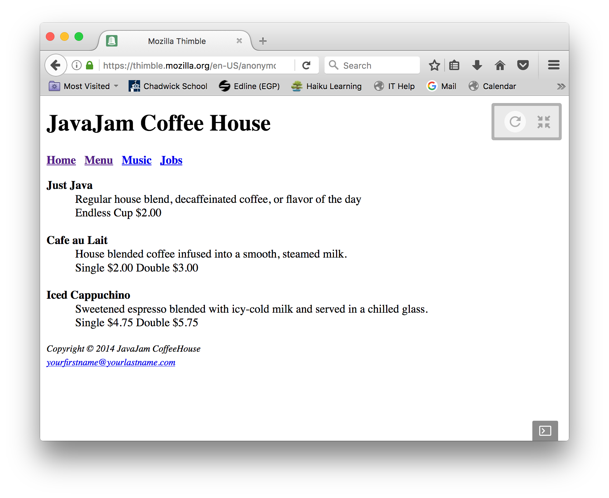
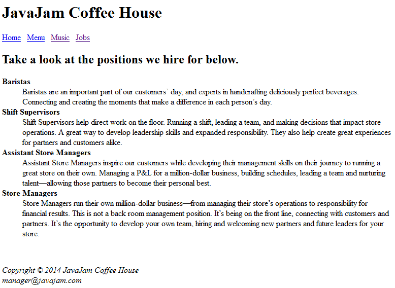

# Day 1 Challenge 

You are creating a website for a Coffee House. Make 4 pages like the following.  

Make sure to replace the starter code in your `index.html` with the code from [template.html](template.html) 

## index.html 

## menu.html

## music.html

## jobs.html

