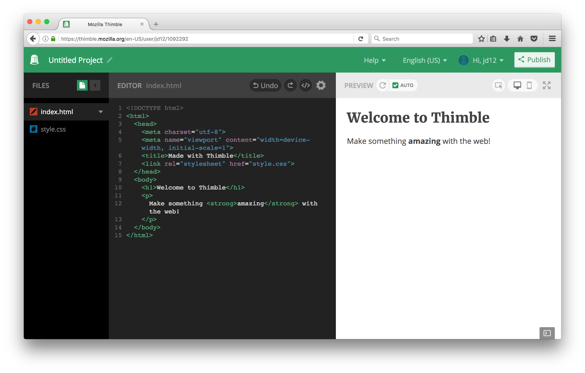
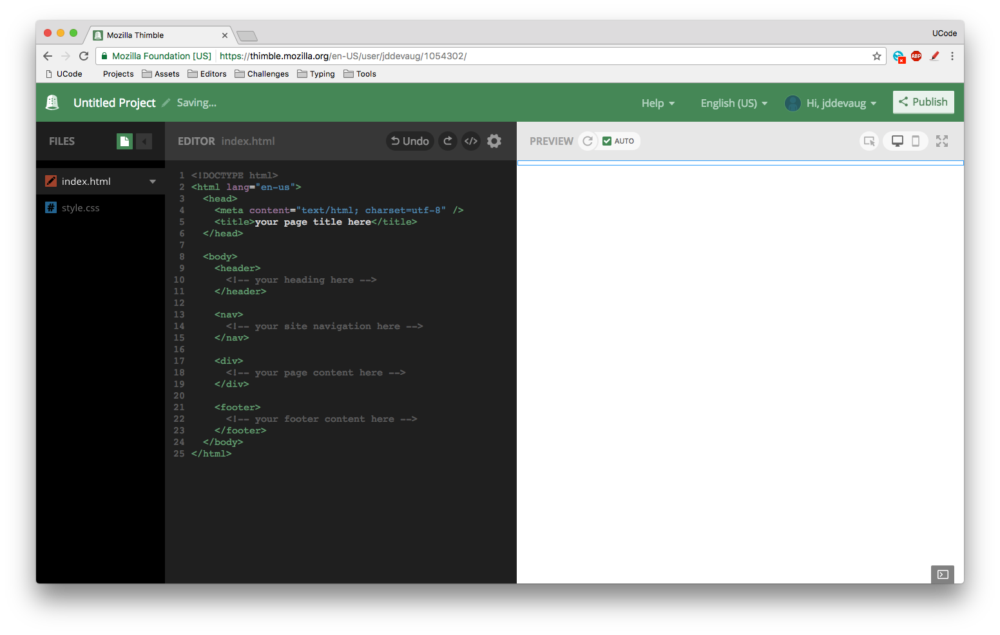
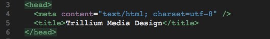
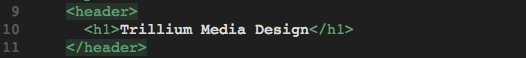
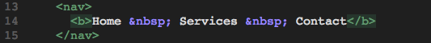
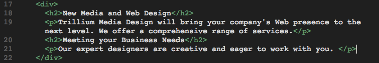
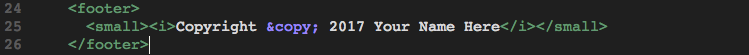

# Warmup Activity Day 1 

1. Start a new project in your Thimble account. It should look like this: 

2. Take the template.html file and replace the contents of the index.html file so that you end up with this:

3. Modify the title of the web page [the text that appears in the tab] by changing the text between the `<title>` and `</title>` tags to `Trillium Media Design` like so: 

4. Position your cursor in the body section and code the header element with the text, "Trillium Media Design" in an h1 element element like so:  

5. Code a nav element to contain text that will indicate the main navigation for the website. Configure bold text using the b element and use the `&nbsp` special character (which stands for Nonbreaking space) to add extra blank space like so:  

6. Code the content within a div element that contains the h2 and paragraph elements. 

7. Configure the footer element to contain a copyright notice displayed in small font size and italic font. Be careful to properly nest the elements as shown here: 

Replace "Your Name Here" with your actual name. 

8. Compare your site to the [insert image] and make any tweaks. 
