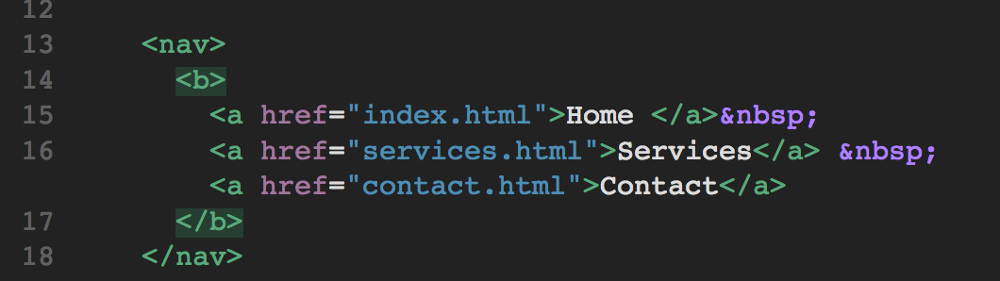

# Warmup Activity Part II

Many websites have multiple websites associated with it. We are going to create multiple websites associated with our website and link them. 

1. The navigation hyperlinks will be located within the nav element. You will edit the code within the nav element to configure three hyperlinks. 
  - The text "Home" will hyperlink to index.html
  - The text "Services" will hyperlink to services.html
  - The text "Contact" will hyperlink to contact.html
  
  Modify the code within the nav element as follows:
  

